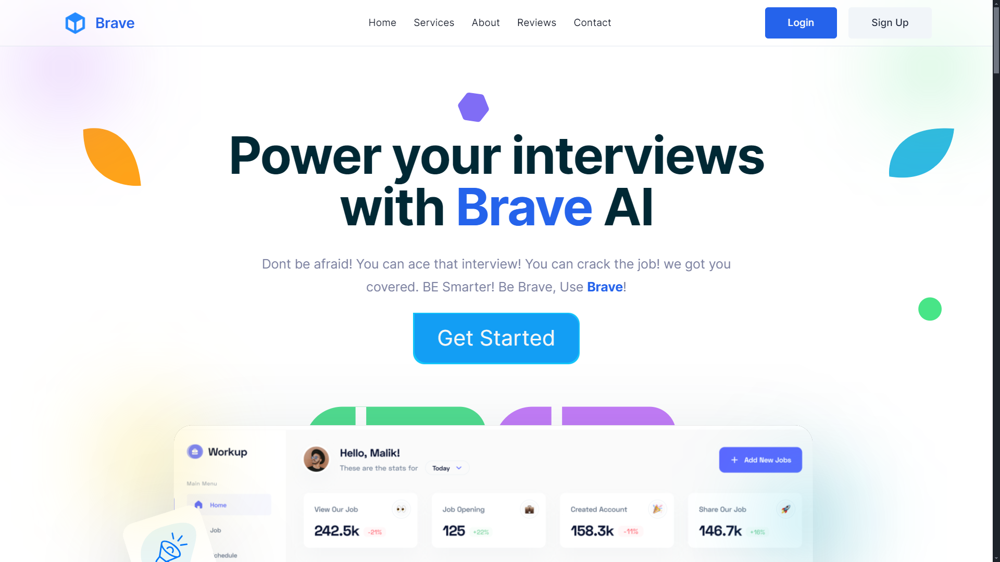

# CanDid - Power Your Interviews with CanDid AI

Be smarter, be CanDid, and use CanDid!

## Project Overview
Welcome to CanDid, the ultimate AI-powered interview preparation suite. Don't be afraid to ace that interview and crack the job! We've got you covered. CanDid is designed to simplify the interview process with advanced AI technology. Our platform helps you generate, personalize, and share detailed interview forms. Prepare efficiently with access to tips, mock interviews, and expert insights. Create standout resumes that impress and pass applicant tracking systems (ATS) in minutes.

## Features
- **AI-Driven Efficiency**
  - Simplifies and enhances every interview step.
  
- **Customizable and Shareable**
  - Access tips, mock interviews, and expert insights to prepare thoroughly.
  
- **Collaborative Community**
  - Share resources and feedback with fellow interviewers.

- **Professional Chatbot**
  - Chat with CanDid Chatbot, fine tuned with job researches.
  
- **Top LinkedIn Jobs**
  - Interviewers can check top LinkedIn jobs directly on our platform.

## Why Choose CanDid?
- **Automation**
  - Save time by automating manual tasks. Simplify workflows, reduce errors, and focus on what matters.
  
- **Efficiency**
  - Enhance every step of the interview process with our AI-driven tools.

## Getting Started
To get started with CanDid, follow these steps:

1. **Visit our Website**
   - Go to [CanDid](https://CanDid-ai-edgex.vercel.app/) to explore our features and services.
   
2. **Create an Account**
   - Sign up to access personalized interview forms, tips, mock interviews, and more.
   
3. **Rest What? Check It up**
   - What to say now, when you reach the dashboard. Now go ahead check it up.

## Contributing
We welcome contributions from the community. If you'd like to contribute, please follow these steps:

1. Fork the repository.
2. Create a new branch (`git checkout -b feature-branch`).
3. Make your changes and commit them (`git commit -m 'Add new feature'`).
4. Push to the branch (`git push origin feature-branch`).
5. Open a pull request.

## Contact
For support or inquiries, please contact us at:
- **Email:** rizzler3902@gmail.com
- **Website:** [CanDid](https://CanDid-ai-edgex.vercel.app/)

---

Be smarter. Be CanDid. Use CanDid!

